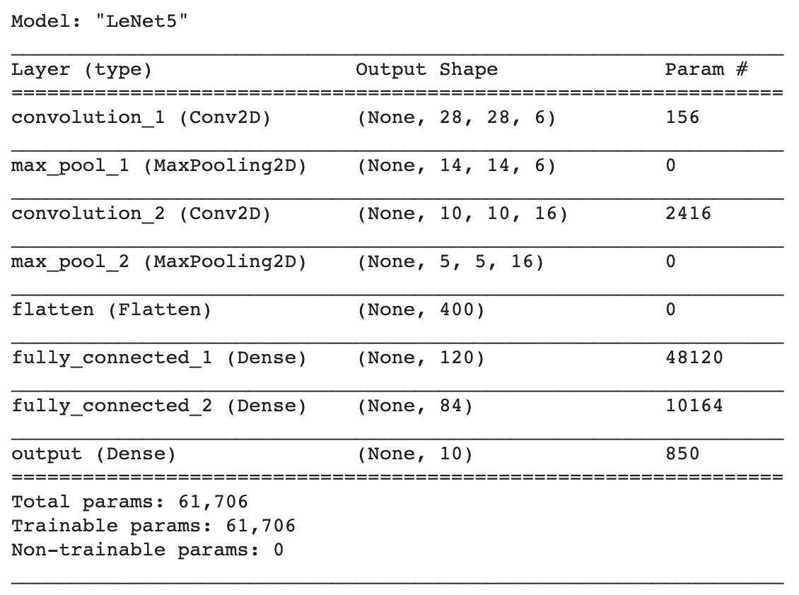

# [Kaggle] Digit Recognizer
> MNIST ("Modified National Institute of Standards and Technology") is the de facto “hello world” dataset of computer vision. Since its release in 1999, this classic dataset of handwritten images has served as the basis for benchmarking classification algorithms. As new machine learning techniques emerge, MNIST remains a reliable resource for researchers and learners alike.  

In this competition, our goal is to correctly identify digits from a dataset of tens of thousands of handwritten images.

***

## Results & Ranking

The best entry (using LeNet v2 described below) scored an accuracy of 99.557% on the test set given by Kaggle with a worldwide rank of 351.

|     Model    | Train Accuracy (%) | Validation Accuracy (%) |
|:------------:|:------------------:|:-----------------------:|
|    LeNet-5   |        99.98       |          99.05          |
| LeNet-5 v1.0 |        99.18       |          99.29          |
| LeNet-5 v2.0 |        99.82       |          99.62          |

***

## Models

### [LeNet-5] Original Architecture

ConvNet --> Pool --> ConvNet --> Pool --> (Flatten) --> FullyConnected --> FullyConnected --> Softmax 

> GradientBased Learning Applied to Document Recognition (Yann LeCun Leon Bottou Yoshua Bengio and Patrick Haffner) (http://vision.stanford.edu/cs598_spring07/papers/Lecun98.pdf)

#### Results

**epochs** - 30  
**loss** - 0.0016  
**train_accuracy** -  0.9998  
**val_loss** -  0.0412  
**val_accuracy** - 0.9905  

##### Highest Dev Set Accuracy Obtained - 99.05%

***

### [LeNet-5 v1] Modified Architecture

ConvNet --> **ConvNet** --> Pool --> **(Dropout)** --> ConvNet --> Pool --> **(Dropout)** --> (Flatten) --> FullyConnected --> FullyConnected --> Softmax 

#### Results

**epochs** - 30  
**loss** - 0.0319  
**train_accuracy** -  0.9918  
**val_loss** -  0.0327  
**val_accuracy** - 0.9929  

##### Highest Dev Set Accuracy Obtained - 99.29%

***

### [LeNet-5 v2] Modified Architecture

ConvNet --> **ConvNet** --> **BatchNorm** --> Pool --> **(Dropout)** --> ConvNet --> **ConvNet** --> **BatchNorm** --> Pool --> **(Dropout)** --> (Flatten) --> **FullyConnected** --> **BatchNorm** --> FullyConnected --> **BatchNorm** --> FullyConnected --> **BatchNorm** --> **(Dropout)** --> Softmax 

#### Results

**epochs** - 30  
**loss** - 0.0112  
**train_accuracy** - 0.9982   
**val_loss** -  0.0192  
**val_accuracy** - 0.9962  

##### Highest Dev Set Accuracy Obtained - 99.62%

***

## A note on Bias & Variance

> It is assumed that the Bayesian error is close to (99.5 - 99.7)% since some digits in the dataset are quite ambigous.

### Variance

Originally, there was overfitting in the model when trained for 30 epochs. It was significantly reduced using Data Augmentation using the Image Data Generator in Keras. Another major improvement was observed when learning rate decay was used instead of a fixed learning rate.

More regularization using Dropouts (25%) after some layers reduced the variance. Batch Normalization, coupled with Dropouts, made the model converge much faster, reaching 99% accuracy within 10 epochs. L2 regularization with lambda of 0.0005 in the convolutional layers reduced the variance of the model as well.

### Bias

The original LeNet-5 architecture performed quite well on the MNIST dataset without any hyperparameter tuning. However, to push the accuracy beyond 99%, more convolutions were added with higher number of filters (36 & 64).

The model gave better results as the number of epochs was increased from 10 to 30, and reached a saturation point around ~35 epochs. 

***

### References

* **Yassine Ghouzam**, PhD - Parameters for Data Augmentation using Image Data Generator, Variable Learning Rate using ReduceLROnPlateau (https://www.kaggle.com/yassineghouzam/introduction-to-cnn-keras-0-997-top-6)

* **Taavish Thaman** - LeNet-5 Keras (https://github.com/TaavishThaman/LeNet-5-with-Keras)
